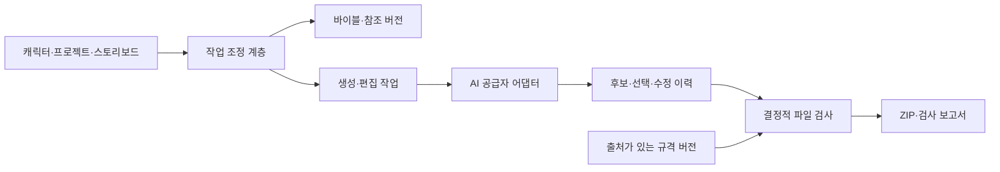

# 시스템 설계 초안

## 현재 상태와 선택 경계

웹 앱을 목표로 하는 설계다. 프론트엔드·백엔드·DB·호스팅·AI 공급자는 미선정이며 운영 코드나 배포 환경이 없다. Python은 저장소 검증용 도구일 뿐 제품 백엔드 선택이 아니다.

## 논리 구성

기획의 Character/Idea/Image/Motion/QA Agent는 기능별 책임을 뜻한다. 여러 자율 에이전트 프로세스를 바로 도입하지 않고 모듈 경계로 시작한다. Motion과 AI 일관성 평가는 후속 범위다. 저장소 운영용 Team Emoti 역할과 제품 내부 역할은 별개다.

## 생성과 편집 계약

- 입력: 프로젝트·항목 ID, 바이블 버전, 참조 자산 ID와 해시, 문구·감정·행동·표정, 프롬프트 템플릿 버전, 선택적 부모 후보 ID.
- 편집 입력은 부모 이미지와 수정 지시를 포함한다. 공급자가 영역 편집을 지원할 때만 마스크 기능을 노출한다.
- 출력: 생성 자산, 공급자/모델 식별자, 요청 ID, 사용량·비용(알 수 없으면 null), seed(지원 시), 실패 사유.
- 캐릭터 참조 없이 요청이 나가지 않도록 필수 입력을 검사한다. 공급자 capability와 일치하지 않는 입력은 조용히 버리지 않는다.
- seed가 존재해도 결과의 완전 재현성을 약속하지 않는다. 실제 입력 스냅샷과 결과 자산을 남긴다.
- API 키는 클라이언트 번들·Git·프롬프트·로그에 넣지 않는다. 인증과 비밀 보관 방식은 스택 선택 시 정한다.

## 작업과 실패

작업 상태는 queued → running → succeeded/failed/cancelled. 취소된 요청에서 늦게 도착한 결과는 자동 선택하지 않는다. 재시도는 새 attempt로 기록하고 같은 사용자 동작의 중복 호출을 막을 idempotency key를 사용한다. 공급자 지원 차이를 숨기지 않으며, 앱의 중복 억제와 공급자 과금 취소 보장은 다르다.

부분 성공한 후보는 보존한다. 사용자 승인 없이 무제한 재시도하거나 전체 세트를 다시 생성하지 않는다. 예상 비용을 표시하고 예산·동시 실행 한도·취소 처리를 공급자 도입 계획에서 확정한다.

## 검사와 내보내기

결정적 검사기는 AI 생성과 분리하고 실제 디코딩한 이미지 정보와 파일 바이트를 검사한다. AI 일관성 검사는 주관적 보조 판단이며 파일 규격 판정을 대체하지 않는다.

검사 보고서는 선택된 후보/해시·바이블 버전·프리셋 버전·검사기 버전에 묶인다. 이미지 선택, 순서, 문구가 포함된 결과, 규격 버전이 바뀌면 보고서는 stale이 되고 내보내기 직전 재검사한다. ZIP은 검증한 스냅샷으로 만들고 임시 다운로드 URL·원본 업로드·비밀키를 포함하지 않는다.

[도메인 모델](domain-model.md), [프리셋 계약](platform-presets.md), [데이터 원칙](../privacy/principles.md)에 세부 조건을 둔다.
