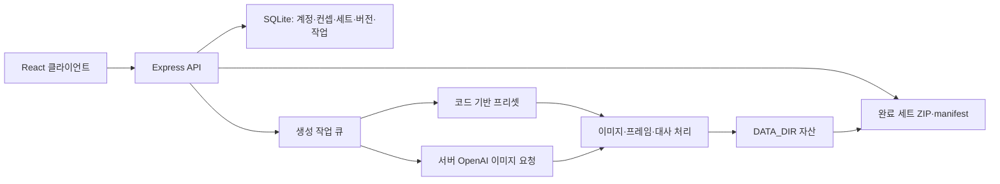

# 시스템 구조

## 구현 상태

현재 저장소는 TypeScript 앱이다. React/Vite 클라이언트(`src/`), Express API(`server/app.ts`), Node 내장 SQLite 저장소(`server/db.ts`)로 구성된다. Node.js 24.15 이상을 사용하며 Python은 하네스 검증용이다. 실행·환경 변수·운영 절차는 [README](../../README.md), HTTP 계약은 [API 계약](../API-CONTRACT.md)이 기준이다.

개발에서는 Vite와 API를 함께 실행하고, production에서는 Express가 빌드된 `dist/`와 API를 제공한다. 기본 `DATA_DIR`는 `./data`이며 SQLite와 생성·업로드 파일을 함께 보존한다. 현재 배포 가정은 영구 저장소가 있는 단일 Node 프로세스다.

## 모듈과 경계

| 경로                                              | 책임                                             |
| ------------------------------------------------- | ------------------------------------------------ |
| `src/App.tsx`, `src/styles.css`                   | 컨셉·세트·검수 UI와 반응형 화면                  |
| `shared/types.ts`, `shared/sticker-plans.ts`      | API 타입, 수량 상수, 프리셋 장면 정의            |
| `server/app.ts`                                   | 세션·소유권·입력 검사, API, 업로드와 내보내기    |
| `server/db.ts`                                    | 스키마·마이그레이션·컨셉/세트/버전 영속화        |
| `server/generation.ts`                            | 작업 큐, sample/openai 생성, 수정·부분 실패 처리 |
| `server/character-art.ts`                         | 늘보군·토끼찬구의 코드 기반 장면·동작            |
| `server/frame-animation.ts`, `server/captions.ts` | 프레임 시트·GIF/WebP·한글 대사 합성              |
| `tests/`, `harness/`                              | 제품 회귀 검사와 저장소 정책 검사                |

기획의 Character/Idea/Image/Motion/QA Agent는 제품 책임을 설명하는 설계 개념이다. 현재 앱이 이 이름의 자율 에이전트 프로세스를 실행하는 것은 아니다. 저장소 운영용 Team Emoti 역할과도 구분한다.

## 생성·수정·보관

`sample`은 외부 AI 호출 없이 준비된 캐릭터·장면을 렌더링한다. `openai`는 서버의 키로 이미지를 요청하며 등록 계정, 선택적 이메일 허용 목록, 계정·전체 요청 한도를 검사한다. 자유 입력의 기획 추천은 현재 규칙 기반이다. API 키를 클라이언트 번들·Git·프롬프트·로그에 넣지 않는다.

컨셉의 캐릭터 정보와 참조는 세트 생성 시 복사된다. 작업 큐 상태는 `queued/running/completed/failed`이며 동시 생성과 중복 저장을 제한한다. 부분 실패한 배치는 저장된 항목을 보존하고 누락 위치를 재시도한다. 사용자용 취소, 범용 idempotency key, 공급자별 비용 원장은 아직 후속 범위다.

개별 수정은 현재 이미지와 피드백을 입력으로 새 버전을 추가하고 검수 승인을 해제한다. 버전 복원은 기존 이력을 삭제하지 않는다. 대사는 `cleanImageUrl`에서 다시 합성하므로 반복 수정 시 글씨가 누적되지 않는다. 움직이는 결과는 프레임 시트와 재생 순서를 보관한다. 세부 미디어 필드는 [도메인 모델](domain-model.md)을 따른다.

## 검증·내보내기와 후속 설계

현재 앱은 업로드 형식·픽셀 제한, 실제 AI 결과의 투명도·완전 중복 픽셀, 프레임 시트 형태, 완료 수량·사용자 승인 등을 검사한다. 정지 PNG 또는 움직이는 WebP/GIF와 PNG 포스터를 manifest와 함께 ZIP으로 내보낸다. 완료는 사용자 검수 완료를 의미하며 플랫폼 심사 승인이나 전체 제출 규격 준수를 뜻하지 않는다.

원래 기획의 다음 계약은 구현 목표로 남긴다.

- 불변 Character Bible·참조 버전과 생성 입력 스냅샷, 명시적인 부모 후보 계보.
- 출처가 있는 `PlatformPresetVersion`과 독립적인 결정적 파일 검사기.
- 선택 이미지·해시·바이블·프리셋·검사기 버전에 묶인 보고서와 변경 시 stale 처리.
- 검사한 스냅샷과 ZIP 대상의 일치, 주관적 AI 일관성 평가와 파일 규격 판정의 분리.

현재 manifest를 위 보고서·스냅샷 계약의 완성으로 해석하지 않는다. [프리셋 설계](platform-presets.md), [데이터 원칙](../privacy/principles.md), [백로그](../product/roadmap.md)에서 후속 범위를 관리한다.
